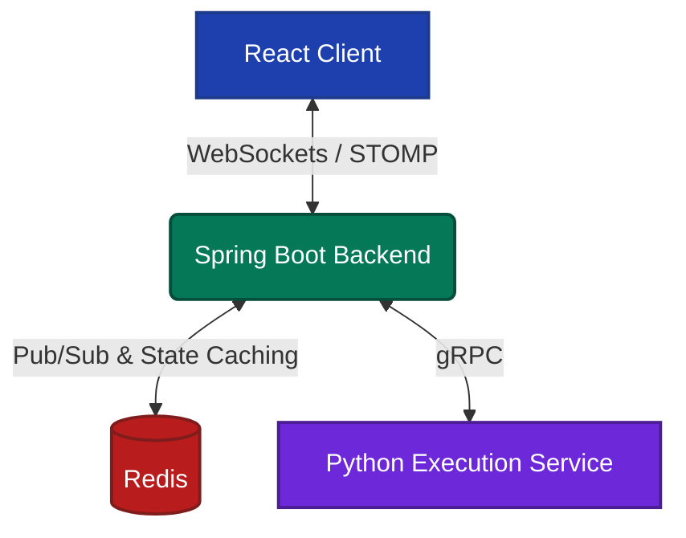

# CodeSync

CodeSync is a browser-based collaborative coding interview workspace that enables interviewers and candidates to solve programming problems together using real-time synchronization, role-based collaboration, and dedicated remote code execution.

## Why CodeSync?

Existing collaborative editors are designed for software development, whereas coding interviews require interviewer/candidate roles, shared problem statements, integrated code execution, and distraction-free collaboration. CodeSync combines these workflows into a single browser-based workspace.

## Features

### Role-Based Collaboration
- **Interviewer Mode:** Read-only access to the code editor, full edit access to the problem statement and private notes, and hidden cursor.
- **Candidate Mode:** Full edit access to the code editor, read-only access to the problem statement, and active cursor broadcasting.

### Real-Time Synchronization
- **State Sync:** Real-time syncing of code, language selection, problem descriptions, and interview notes using WebSockets and STOMP.
- **Remote Cursors:** Interviewers can track exactly where the candidate is typing in real-time.
- **State Persistence:** Redis caches the latest room state while Redis Pub/Sub propagates updates across backend instances, enabling late joiners and horizontal scaling.

### Dedicated Code Execution
- **Multi-Language Support:** Currently supports Python 3 and C++ (g++).
- **Remote Execution:** Code is executed via a decoupled Python gRPC execution service, which processes the code, handles stdin, and streams the output back to the workspace.

## Future Improvements
- Session replay using event sourcing
- Shared interview timer
- Dockerized execution sandbox for secure multitenancy

## Architecture



## How to Run Locally

### 1. Start the Redis Server
Ensure you have a local Redis server running on port `6379`.

### 2. Start the Python Execution Service
```bash
cd execution-service
pip install grpcio grpcio-tools
python execution_server.py
```

### 3. Start the Java Backend
```bash
cd backend
mvn clean package -DskipTests
java -jar target/codesync-0.0.1-SNAPSHOT.jar
```

### 4. Start the React Frontend
```bash
cd frontend
npm install
npm run dev
```
